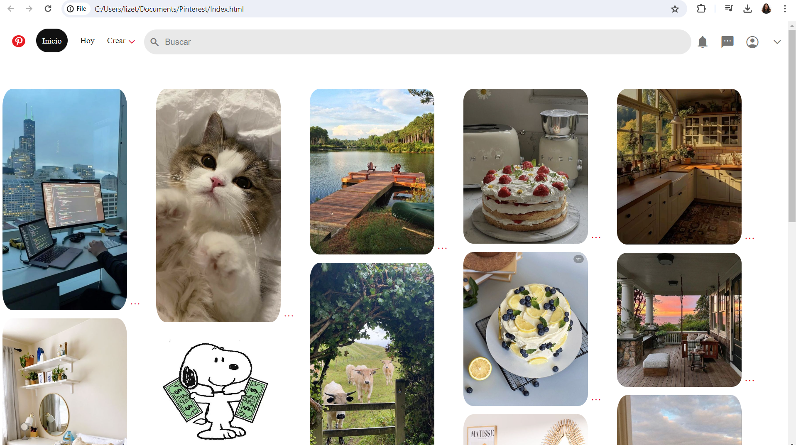

# Clon de pinterest con HTML y CSS
Este proyecto es un clon de la interfaz de usuario de Pinterest creado puramente con HTML 5 y CSS 3.

Se enfoca en replicar la apariencia visual de pinterest, ofreciendo una experiencia de navegación similar con un diseño responsive y funcionalidades básicas.

### Caracteristicas
**Diseño responsive**: adaptable a diferentes tamaños de pantalla para una erxperiencia de usuario optima en dispositivos móviles y de escritorios.
**Interfaz de usuario intuitiva**: Inspirada en pinterest, con una navegación facil y flexible.
**Interacciones dinámicas** Efectos visuales para elementos interactivos como botones y enlaces😎
**Iconografia y estilos modernos** Uso de la biblioteca de iconos de Material Design y estilos CSS modernos para una apariencia cool.

###Tecnologías utilizadas
+**HTML 5** Para la estructura básica del sitio
+**CSS 3** Para el diseño y el estilo, incluyendo _flexbox_ para un diseño responsivo y efectos de _hover_

###Vista previa del proyecto

### Contacto
Si te gustaría invitarme a colaborar en un proyecto, escribeme por [LinkedIn](https://www.linkedin.com/in/lizeth-carrillo-457826209/)
